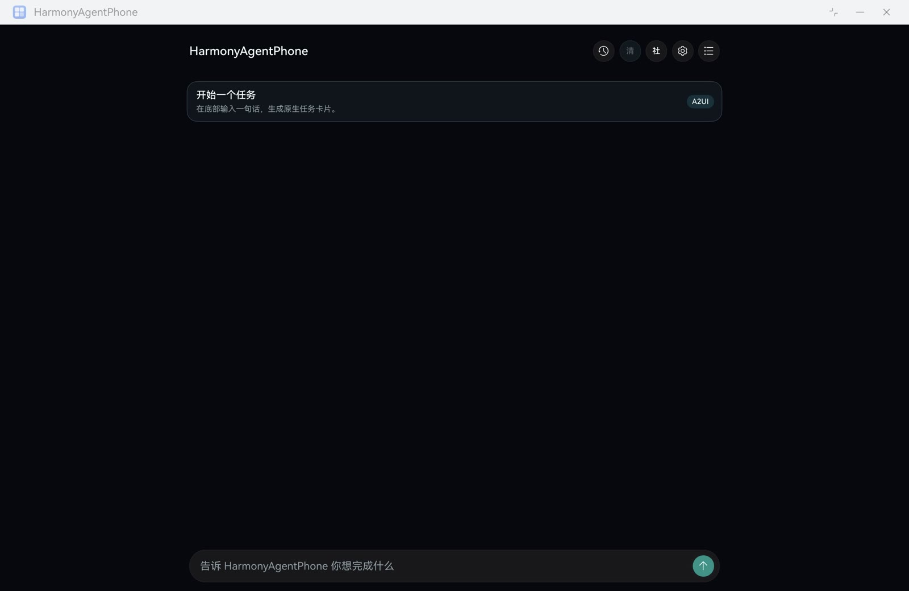
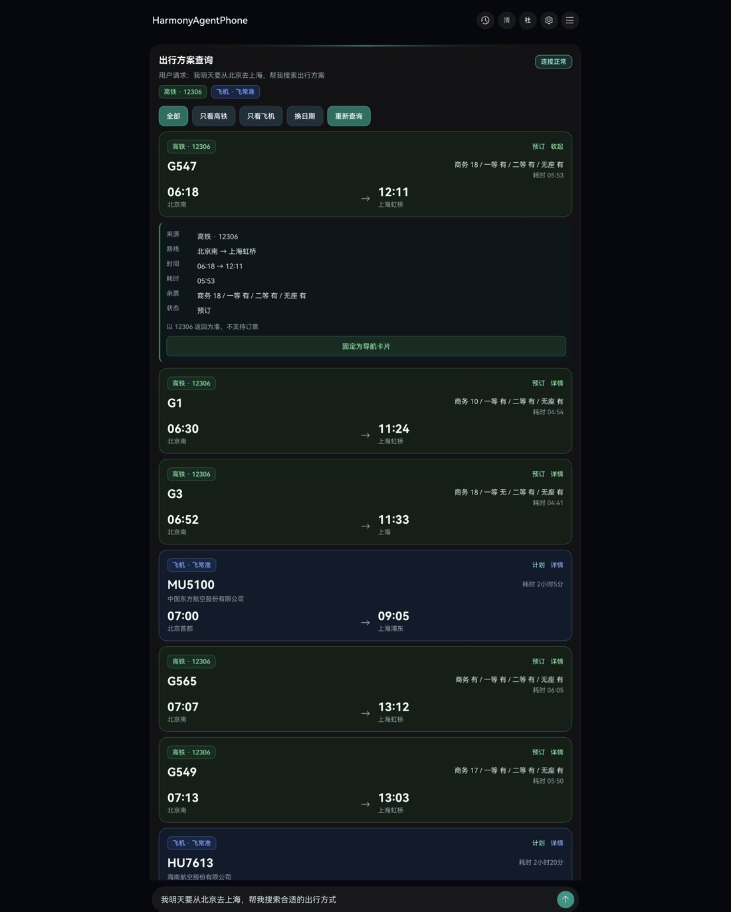
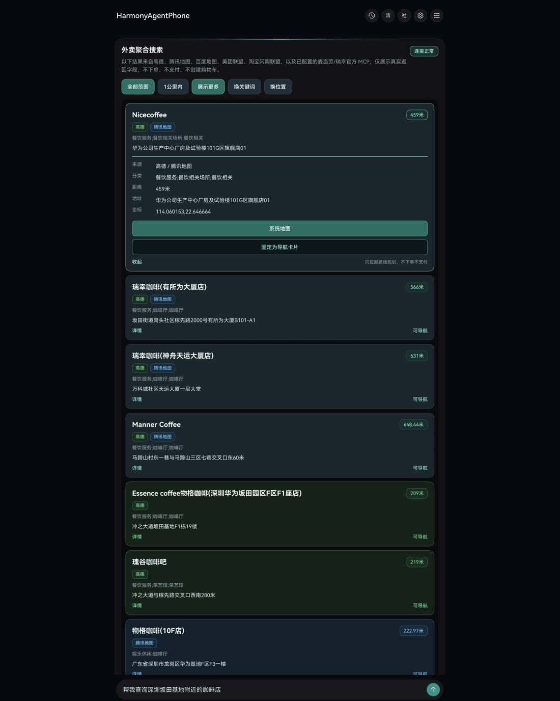
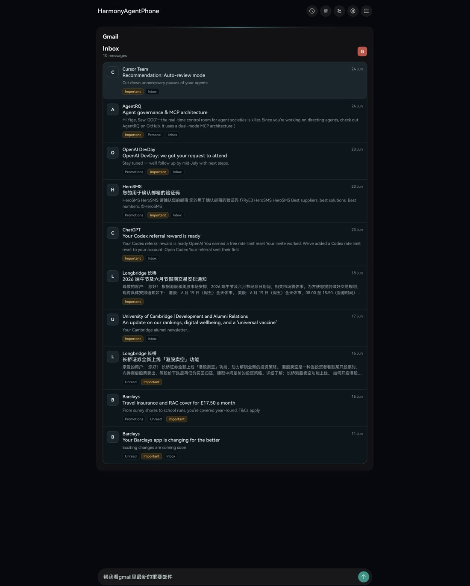
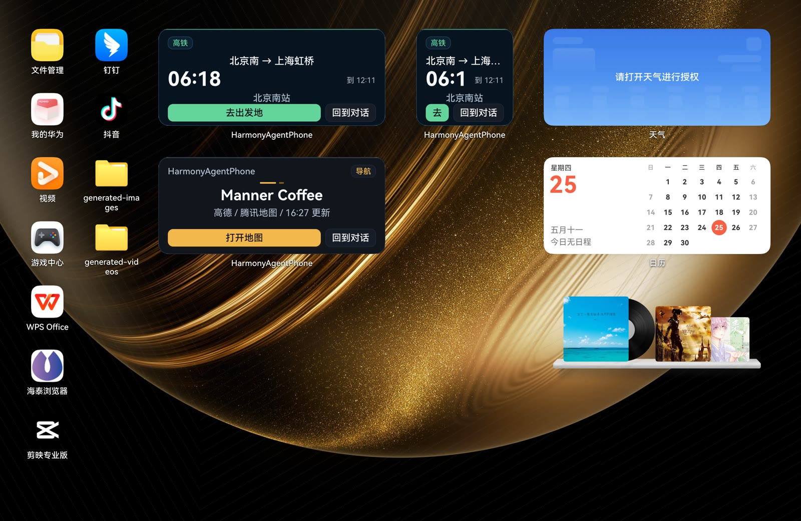
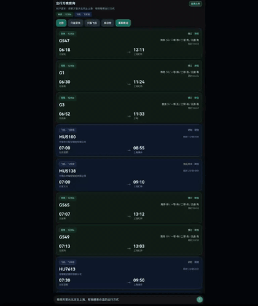
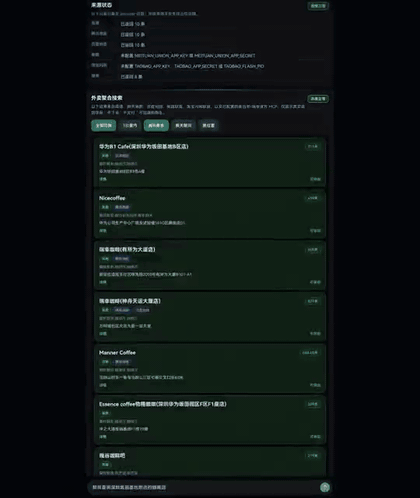
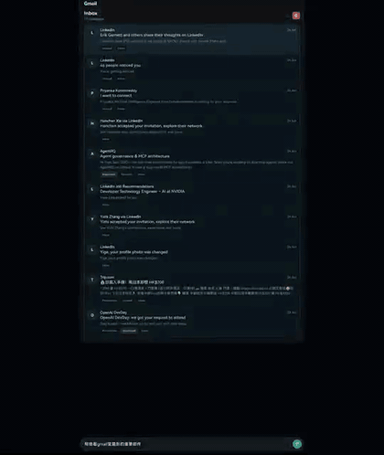
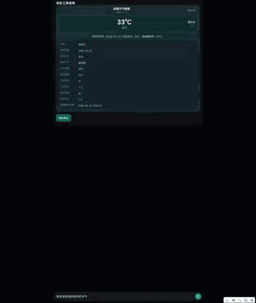

# HarmonyAgentPhone

HarmonyAgentPhone is a HarmonyOS demo that turns a short request into a focused phone task. It can open travel results, nearby places, Gmail views, weather, and pinned home cards as native ArkUI screens.

The app is built around one compact flow: type a request, review the card, and keep useful results on the home screen.

## What it shows

- Travel choices across rail and flight
- Nearby place search with map actions
- Gmail inbox and draft flows
- Dynamic weather lookup
- Home cards for saved results

## Screenshots

### Travel planning

Query: `我明天要从北京去上海，帮我搜索合适的出行方式`

Mixed rail and flight results appear in a single task card with filters and detail rows.

### Nearby coffee

Query: `帮我查询深圳坂田基地附近的咖啡店`

Nearby places are grouped into clear cards with distance, address, map, and pin actions.

### Gmail inbox

Query: `帮我看 Gmail 里最新的重要邮件`

The inbox view keeps message summaries, labels, and dates readable inside the app.

### Home cards

Selected results can stay on the HarmonyOS home screen as quick action cards.

## Video previews

GitHub README pages do not always show repository MP4 files as inline players. These short GIF previews play in place. Click a preview to open the full MP4.

### 我明天要从北京去上海，帮我搜索合适的出行方式

### 帮我查询深圳坂田基地附近的咖啡店

### 帮我看 Gmail 里最新的重要邮件

### 帮我给 Gmail 里最近一封邮件起草回复

### 帮我查深圳明天天气

## Run locally

1. Open this repository in DevEco Studio.
2. Run the `entry` module on a HarmonyOS device or emulator.
3. Type a request in the bottom input.

## License

No open-source license has been selected yet. All rights are reserved unless a license is added later.
